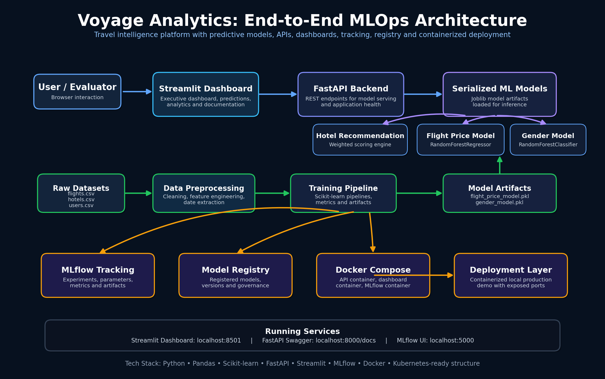
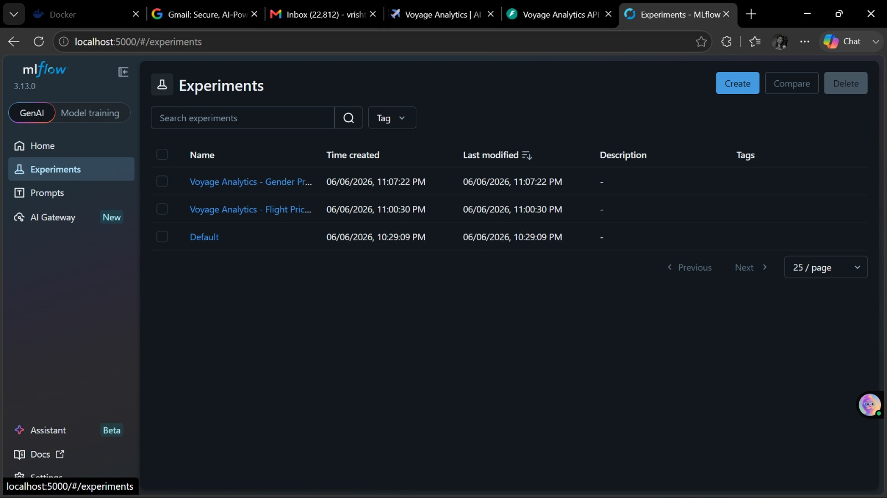
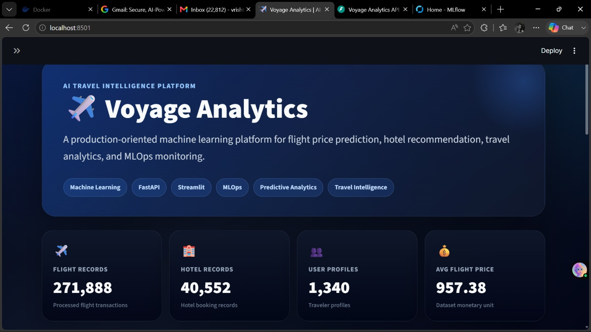
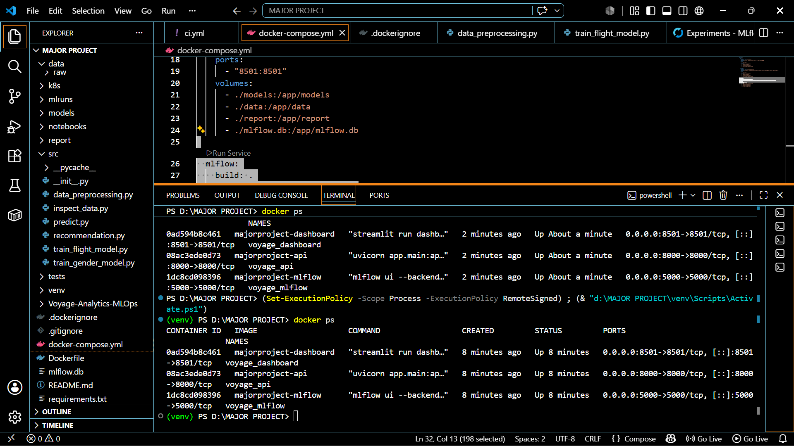

# ✈️ Voyage Analytics

## AI-Powered Travel Intelligence Platform with End-to-End MLOps

Voyage Analytics is a production-oriented Machine Learning and MLOps platform developed to demonstrate the complete lifecycle of modern AI systems, from data ingestion and model training to deployment, monitoring, and experiment management.

The platform integrates predictive analytics, recommendation systems, experiment tracking, model versioning, API serving, interactive dashboards, and containerized deployment into a unified ecosystem. It serves as a practical implementation of modern MLOps principles and scalable machine learning workflows.

---

## 🚀 Project Highlights

* Flight Price Prediction using Machine Learning
* Hotel Recommendation Engine
* Interactive Travel Analytics Dashboard
* FastAPI-Based Model Serving
* MLflow Experiment Tracking
* Model Registry and Version Management
* Dockerized Multi-Service Deployment
* Streamlit Interactive Frontend
* End-to-End MLOps Workflow
* Git-Based Version Control

---

## 🎯 Business Problem

Travel planning often involves dynamic pricing, multiple service providers, and rapidly changing customer preferences. Traditional systems provide static information but lack predictive intelligence and personalization.

Voyage Analytics addresses this challenge by combining machine learning models, recommendation systems, analytics dashboards, and deployment infrastructure to provide intelligent travel insights through a unified platform.

---

# 🏗️ System Architecture

The platform follows a modular MLOps architecture consisting of:

1. Data Layer
2. Data Processing Layer
3. Machine Learning Layer
4. Model Management Layer
5. API Serving Layer
6. Analytics & Visualization Layer
7. Deployment Layer

### Architecture Diagram



---

# 📸 Project Demonstration

## MLflow Experiment Tracking



MLflow is used for:

* Experiment Tracking
* Parameter Logging
* Metrics Monitoring
* Artifact Storage
* Model Versioning
* Reproducibility Management

---

## Streamlit Analytics Dashboard



The dashboard provides:

* KPI Monitoring
* Travel Analytics
* Model Predictions
* Recommendation Insights
* Business Intelligence Visualizations

---

## FastAPI Swagger Documentation


Interactive API documentation generated using FastAPI and Swagger UI.

---

## Dockerized Deployment



Multi-container deployment using Docker Compose including:

* FastAPI Service
* Streamlit Dashboard
* MLflow Tracking Server

---

# 🧠 Core Modules

## Flight Price Prediction

A supervised Machine Learning model designed to estimate airfare using travel-related features.

### Input Features

* Origin City
* Destination City
* Airline
* Flight Type
* Distance
* Travel Month
* Travel Day

### Output

* Estimated Flight Price

---

## Hotel Recommendation Engine

A recommendation system developed to assist travelers in selecting suitable accommodations.

### Recommendation Factors

* User Preferences
* Hotel Ratings
* Pricing Factors
* Travel Requirements
* Personalized Recommendation Logic

### Output

* Ranked Hotel Recommendations

---

## Travel Analytics Dashboard

An interactive analytics platform developed using Streamlit.

### Dashboard Features

* Travel Data Exploration
* KPI Monitoring
* Predictive Analytics
* Recommendation Results
* Operational Analytics
* Business Insights

---

## FastAPI Inference Layer

Production-ready REST APIs developed using FastAPI.

### Available Endpoints

* Flight Price Prediction
* Hotel Recommendation
* Gender Prediction
* Health Check

### Swagger Documentation

```text
http://localhost:8000/docs
```

---

## MLflow MLOps Integration

MLflow is integrated to manage the complete machine learning lifecycle.

### Implemented Components

* Experiment Tracking
* Hyperparameter Logging
* Metrics Monitoring
* Artifact Storage
* Model Registry
* Model Version Control

### Benefits

* Reproducibility
* Traceability
* Governance
* Lifecycle Management

---

## Dockerized Deployment

The complete platform is containerized and orchestrated using Docker Compose.

### Services

| Service                | Port |
| ---------------------- | ---- |
| FastAPI                | 8000 |
| Streamlit Dashboard    | 8501 |
| MLflow Tracking Server | 5000 |

### Benefits

* Environment Isolation
* Reproducible Builds
* Simplified Deployment
* Scalability Readiness

---

# ⚙️ Technology Stack

## Programming Language

* Python 3.12

## Data Science & Machine Learning

* Pandas
* NumPy
* Scikit-Learn

## Backend Development

* FastAPI
* Uvicorn

## Frontend & Visualization

* Streamlit

## MLOps

* MLflow

## Containerization

* Docker
* Docker Compose

## Version Control

* Git
* GitHub

---

# 📂 Project Structure

```text
voyage-analytics-mlops
│
├── app/
├── dashboard/
├── data/
│   ├── raw/
│   └── processed/
│
├── k8s/
├── models/
├── notebooks/
├── report/
│   └── Screenshots/
│
├── src/
│   ├── data_preprocessing.py
│   ├── train_flight_model.py
│   ├── train_gender_model.py
│   ├── recommendation.py
│   └── predict.py
│
├── mlruns/
├── Dockerfile
├── docker-compose.yml
├── requirements.txt
├── README.md
└── .gitignore
```

---

# 🚀 Getting Started

## Clone Repository

```bash
git clone https://github.com/Vrishti-vibes/voyage-analytics-mlops.git
cd voyage-analytics-mlops
```

## Install Dependencies

```bash
pip install -r requirements.txt
```

## Run Using Docker

```bash
docker compose up --build
```

---

# 🌐 Available Services

### Streamlit Dashboard

```text
http://localhost:8501
```

### FastAPI Application

```text
http://localhost:8000
```

### FastAPI Swagger UI

```text
http://localhost:8000/docs
```

### MLflow Tracking Server

```text
http://localhost:5000
```

---

# ✅ Key Achievements

* End-to-End Machine Learning Pipeline
* Flight Price Prediction Model
* Hotel Recommendation System
* Gender Classification Model
* MLflow Experiment Tracking
* Model Registry Integration
* FastAPI Deployment
* Streamlit Analytics Dashboard
* Dockerized Multi-Service Architecture
* Reproducible MLOps Workflow
* Git-Based Collaboration Workflow

---

# 🔮 Future Enhancements

* Real-Time Flight Data Integration
* Cloud Deployment on AWS
* Kubernetes Orchestration
* CI/CD Automation
* Automated Model Retraining
* Recommendation Engine Optimization
* Monitoring & Alerting Framework
* Distributed MLOps Infrastructure

---

# 📌 Conclusion

Voyage Analytics demonstrates a complete end-to-end Machine Learning and MLOps ecosystem that integrates data engineering, predictive modeling, recommendation systems, experiment tracking, model governance, API deployment, analytics visualization, and containerized infrastructure.

The project reflects industry-standard software engineering and MLOps practices while serving as a scalable foundation for intelligent travel analytics applications.

---

# 👩‍💻 Author

**Kumari Vrishti**

B.Tech Computer Science Engineering

Machine Learning • MLOps • Backend Development • Data Analytics

GitHub: https://github.com/Vrishti-vibes
